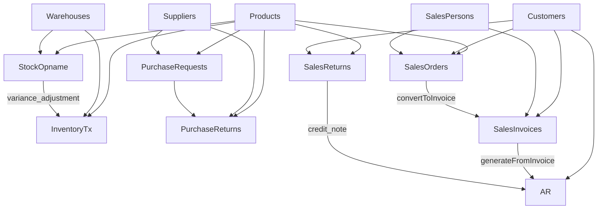

# RASHA Super App — Knowledge Base

> **Version:** 1.0.0
> **Last Updated:** 2025-06-07
> **Purpose:** Single source of truth for the RASHA Super App's
    flows, data, statuses, and architecture
> **Philosophy:** Manoratha (मनोरथ - Dream) + Akasha (आकाश - Universe) =
    "The Universe of Dreams"

---

## 📋 Table of Contents

1. [System Overview](#system-overview)
2. [Menu Structure](#menu-structure)
3. [Business Flows](#business-flows)
4. [Data Classification](#data-classification)
5. [Status Workflows](#status-workflows)
6. [Module Integration Map](#module-integration-map)
7. [Reports & Analytics](#reports--analytics)
8. [Technology Stack](#technology-stack)

---

## System Overview

RASHA is a **modular microservices-based Super App** inspired by Odoo,
built with Laravel + Angular. It covers the **Revenue Cycle** (Sales → Cash),
**Procurement Cycle** (Request → Pay),
**Inventory Management Cycle** (Stock movements → Physical count → Adjustment),
and extends into **CRM**, **HRM**, **Project Management**, **E-Commerce**,
**POS**, **Accounting**, and **Dynamic Forms**.

### Architecture: Modular Microservices

Each business module operates as an independent microservice
with its own database, deployable and scalable independently.
The Angular super app shell provides a unified UI with API Gateway routing via Nginx.

### Implementation Status Legend

| Icon |                      Meaning                      |
|------|---------------------------------------------------|
|  ✅  | Fully implemented (FE + BE + DB)                  |
|  ⚠️  | Partially implemented (FE placeholder or missing) |
|  🔲  | Not yet built                                     |

---

## Menu Structure

Current navigation menu as implemented:

```txt
📊 Dashboard                /dashboard
📋 Master Data              (group)
├── Products                /master-data/products
├── Warehouses              /master-data/warehouses
├── Customers               /master-data/customers
├── Suppliers               /master-data/suppliers
├── Sales Persons           /master-data/sales-persons
├── Bank Accounts           /master-data/bank-accounts
📦 Inventory                (group)
├── Transactions            /inventory/transactions
├── Stock Opname            /inventory/opname
📈 Sales                    (group)
├── Sales Orders            /sales/orders
├── Invoices                /sales/invoices
├── AR / Piutang            /sales/ar
├── Sales Returns           /sales/returns
📥 Purchasing               (group)
├── Purchase Requests       /purchasing/requests
├── Purchase Returns        /purchasing/returns
📉 Reports                  /reports
```

---

## Business Flows

### 🟢 Revenue Cycle (Sales → Cash)

```txt
Customer → Sales Order → Delivery → Invoice → Accounts Receivable → Payment Collection
```

| Step |         Module          | Status |                                  Description                                   |
|------|-------------------------|--------|--------------------------------------------------------------------------------|
|  1   | **Sales Order**         |   ✅   | Order entry with multi-item support, auto-order numbering, status tracking     |
|  2   | *Delivery*              |   ⚠️   | No separate delivery module; delivery status tracked within Sales Order states |
|  3   | **Sales Invoice**       |   ✅   | Billing with tax, discount, auto-invoice numbering, due date tracking          |
|  4   | **Accounts Receivable** |   ✅   | Aging tracking, payment recording, dispute management, write-off               |
|  5   | **Sales Returns**       |   ✅   | RMA workflow: request → approve → receive → inspect → credit note              |
|  —   | **Sales Persons**       |   ✅   | Sales team management, commission rate tracking (Master Data)                  |

#### End-to-End Scenario

```txt
Sales Order (draft) → confirmed → partially_delivered → fully_delivered
    → Invoice (issued) → AR (open) → Payment (partial/paid)
    ↘ Return → inspect → credit_note (reduces AR)
```

### 🔵 Procurement Cycle (Request → Pay)

```txt
Internal Need → Purchase Request → Approval → Supplier → Goods Receipt → Payment
```

| Step |        Module         | Status |                                         Description                                         |
|------|-----------------------|--------|---------------------------------------------------------------------------------------------|
|  1   | **Purchase Request**  |   ✅   | Department procurement with multi-item support, approval workflow                           |
|  2   | *Purchase Order*      |   🔲   | Not yet built — PR currently stops at approval/closed status                                |
|  3   | *Goods Received Note* |   🔲   | Not yet built — receiving is tracked via PR status (`partially_received`, `fully_received`) |
|  4   | **Purchase Returns**  |   ✅   | Full RMA workflow: request → approve → send goods → debit note → close                      |
|  —   | **Suppliers**         |   ✅   | Supplier directory with contact info, NPWP, payment terms                                   |
|  —   | **Bank Accounts**     |   ✅   | Bank accounts with currency, branch details for AR payments                                 |

### 🟠 Inventory Management Cycle

```txt
Stock In → Movement → Stock Out → Physical Count → Variance Review → Adjustment
```

| Step |           Module           | Status |                               Description                                |
|------|----------------------------|--------|--------------------------------------------------------------------------|
|  1   | **Inventory Transactions** |   ✅   | IN / OUT / ADJUSTMENT with full audit trail                              |
|  2   | **Stock Opname**           |   ✅   | Physical counting workflow: schedule → count → review → approve → adjust |
|  3   | **Warehouses**             |   ✅   | Multi-warehouse support with location and capacity tracking              |

### 🟣 Master Data Management

|    Entity     |   Module    | Status |                        Description                        |
|---------------|-------------|--------|-----------------------------------------------------------|
| Products      | Master Data |   ✅   | SKU-based product catalog with pricing and stock tracking |
| Warehouses    | Master Data |   ✅   | Storage locations with capacity                           |
| Customers     | Master Data |   ✅   | Customer directory with contact info                      |
| Suppliers     | Master Data |   ✅   | Supplier directory with contact, NPWP, payment terms      |
| Sales Persons | Master Data |   ✅   | Sales team members with commission rates                  |
| Bank Accounts | Master Data |   ✅   | Bank accounts with currency, branch details               |
| Users         | Auth        |   ✅   | System users with Sanctum token auth                      |

---

## Data Classification

### 📋 Master Data (Slow-changing, Referenced by Transactions)

|       Table       |                                  Key Fields                                   |                   Used By                   |
|-------------------|-------------------------------------------------------------------------------|---------------------------------------------|
| **products**      | id, name, sku (unique), price, stock_quantity, is_active                      | Sales Orders, Inventory, Returns            |
| **warehouses**    | id, name, location, capacity                                                  | Inventory, Stock Opname                     |
| **customers**     | id, name, email (unique), phone, city, country                                | Sales Orders, Invoices, Returns, AR         |
| **suppliers**     | id, name, email, phone, npwp (unique), payment_terms, is_active               | Purchase Requests, Purchase Returns         |
| **sales_persons** | id, name, commission_rate, is_active                                          | Sales Orders, Invoices                      |
| **bank_accounts** | id, bank_name, account_name, account_number, currency_code, branch, is_active | AR Payments                                 |
| **users**         | id, name, email                                                               | Auth, audit trail (created_by, approved_by) |

### 📦 Transactional Data (Event-driven, Time-sensitive)

| Table | Parent Flow | Key Fields |
|----------------------------|-------------|----------------------------------------------------------------------------------------------|
| **sales_orders**           | Revenue     | customer_id, order_number, order_date, status, total_amount                                  |
| **sales_order_items**      | Revenue     | sales_order_id, product_id, quantity, unit_price, total_price                                |
| **sales_invoices**         | Revenue     | customer_id, invoice_number, due_date, subtotal, tax, total, paid_amount                     |
| **invoice_items**          | Revenue     | invoice_id, product_id, quantity, unit_price, total_price                                    |
| **accounts_receivable**    | Financial   | customer_id, invoice_id, ar_number, amount_original, amount_paid, amount_remaining, due_date |
| **ar_payments**            | Financial   | accounts_receivable_id, payment_date, payment_method, paid_amount                            |
| **inventory_transactions** | Inventory   | product_id, warehouse_id, transaction_type (IN/OUT/ADJUSTMENT), quantity                     |
| **purchase_requests**      | Procurement | pr_number, supplier_id, department, status, total_estimated_amount                           |
| **purchase_request_items** | Procurement | purchase_request_id, product_id, quantity, unit_price                                        |
| **stock_opnames**          | Inventory   | warehouse_id, opname_number, status, scheduled_date                                          |
| **stock_opname_items**     | Inventory   | stock_opname_id, product_id, system_quantity, counted_quantity, variance                     |
| **sales_returns**          | Revenue     | customer_id, invoice_id, return_number, rma_number, status, disposition, credit_note         |
| **sales_return_items**     | Revenue     | sales_return_id, product_id, quantity, unit_price                                            |
| **purchase_returns**       | Procurement | supplier_id, return_number, status, reason, shipping_cost, debit_note                        |
| **purchase_return_items**  | Procurement | purchase_return_id, product_id, quantity, unit_price                                         |

---

## Status Workflows

### Sales Order

```
                    ┌─────────┐
                    │  draft  │
                    └────┬────┘
                         │
                    ┌────▼─────┐
                    │ confirmed │
                    └────┬──────┘
                         │
              ┌──────────┴──────────┐
              │                     │
    ┌─────────▼───────────┐    ┌────▼────┐
    │ partially_delivered │    │ cancelled│
    └─────────┬───────────┘    └──────────┘
              │
    ┌─────────▼────────┐
    │ fully_delivered   │
    └─────────┬─────────┘
              │
    ┌─────────▼─────┐
    │   invoiced     │
    └─────────┬──────┘
              │
    ┌─────────▼─────┐
    │    closed      │
    └────────────────┘
```

> Note: Initial migration used
   `pending → confirmed → shipped → delivered → cancelled`.
   Updated via migration `2023_01_01_000017` to current values.

### Sales Invoice

```txt
draft → issued → paid
           ↘ overdue
           ↘ cancelled
```

### Sales Return (RMA Workflow)

```txt
requested → approved → goods_in_transit → received → inspected → credit_issued → closed
```

- **Disposition** (upon inspection): `resaleable`, `rework`, `scrap`, `return_to_supplier`

### Accounts Receivable

```txt
open → partial → paid
   ↘ overdue
   ↘ disputed
   ↘ written_off
```

- **Payment Methods**: `transfer`, `giro`, `cash`, `check`

### Purchase Request

```txt
draft → pending_approval → approved → sent_to_supplier → partially_received → fully_received → closed
                                                                                      ↘ cancelled
```

- Additional method: `submit` to move from draft → pending_approval
- If cancelled → cancelled

### Purchase Return

```txt
requested → approved → goods_in_transit → received → inspected → debit_issued → closed
```

- **Reason** (upon creation): `defective`, `wrong_item`, `not_as_specified`, `excess_quantity`, `expired`, `damaged_in_transit`
- BE workflow endpoints: `POST approve`, `POST send-goods`, `POST debit-note`, `POST close`

### Stock Opname

```txt
scheduled → in_progress → counting_done → variance_review → approved → adjusted → closed
```

---

## Module Integration Map



### Key Integration Endpoints (BE API)

|                      Endpoint                       |     From      |      To       |                Purpose                |
|-----------------------------------------------------|---------------|---------------|---------------------------------------|
| `POST /api/sales-orders/{id}/convert-to-invoice`    | Sales Order   | Sales Invoice | Generate invoice from delivered order |
| `POST /api/invoices/{invoiceId}/generate-ar`        | Sales Invoice | AR            | Create AR record from invoice         |
| `POST /api/accounts-receivable/{id}/payment`        | AR            | AR Payment    | Record payment against receivable     |
| `POST /api/accounts-receivable/{id}/write-off`      | AR            | —             | Write off bad debt                    |
| `POST /api/accounts-receivable/{id}/toggle-dispute` | AR            | —             | Mark/unmark as disputed               |
| `POST /api/purchase-requests/{id}/submit`           | PR            | —             | Submit for approval                   |
| `POST /api/purchase-requests/{id}/approve`          | PR            | —             | Approve request                       |
| `POST /api/stock-opnames/{id}/start`                | Opname        | —             | Begin physical counting               |
| `POST /api/stock-opnames/{id}/complete`             | Opname        | —             | Finish counting                       |
| `POST /api/stock-opnames/{id}/approve-adjustment`   | Opname        | Inventory     | Approve variance adjustment           |
| `POST /api/sales-returns/{id}/approve`              | Return        | —             | Approve return request                |
| `POST /api/sales-returns/{id}/credit-note`          | Return        | AR            | Issue credit note (reduces AR)        |

---

## Reports & Analytics

|   Category    |               Report Endpoint                |         Description         |
|---------------|----------------------------------------------|-----------------------------|
| **Sales**     | `GET /api/reports/sales/revenue`             | Revenue trends over time    |
| **Sales**     | `GET /api/reports/sales/top-products`        | Best-selling products       |
| **Sales**     | `GET /api/reports/sales/by-customer`         | Sales breakdown by customer |
| **Sales**     | `GET /api/reports/sales/summary`             | Aggregate sales summary     |
| **Inventory** | `GET /api/reports/inventory/stock-summary`   | Current stock levels        |
| **Inventory** | `GET /api/reports/inventory/low-stock`       | Products below threshold    |
| **Inventory** | `GET /api/reports/inventory/transactions`    | Inventory movement history  |
| **Customers** | `GET /api/reports/customers/top`             | Top customers by revenue    |
| **Customers** | `GET /api/reports/customers/activity`        | Customer activity timeline  |
| **AR**        | `GET /api/accounts-receivable/aging-summary` | AR aging buckets (implicit) |

---

## Technology Stack

|        Layer        |                  Technology                   |  Version   |
|---------------------|-----------------------------------------------|------------|
| **Frontend**        | Angular (Standalone Components, SSR)          | 20.x       |
| **Backend Core**    | PHP + Laravel                                 | 8.4 / 13.x |
| **Backend Future**  | Python (FastAPI/Django) / Java (Spring Boot)  | Planned    |
| **Database**        | PostgreSQL (Database per service)             | 16         |
| **Cache**           | Redis                                         | 7          |
| **Auth**            | Laravel Sanctum (Token-based) + RBAC (Spatie) | Latest     |
| **Infrastructure**  | Docker + Docker Compose + Docker Buildx Bake  | 24.x       |
| **Base OS**         | Ubuntu                                        | 24.04 LTS  |
| **Web Server**      | Nginx                                         | 1.26+      |
| **Process Mgmt**    | Supervisor (PHP) / PM2 (Node.js)              | 4.x        |
| **Frontend Future** | Module Federation (multi-framework)           | Planned    |

---

*This document is the single source of truth for RASHA system knowledge.
 All development should reference this document for flows, statuses, and data definitions.*
